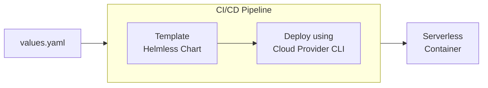

```mermaid
graph LR
    A[values.yaml] --> B[CI/CD Pipeline]
    subgraph B[CI/CD Pipeline]
        direction LR
        B1[Template
        Helmless Chart] --> B2[Deploy using
        Cloud Provider CLI]
    end
    B --> D[Serverless
    Container]
```
