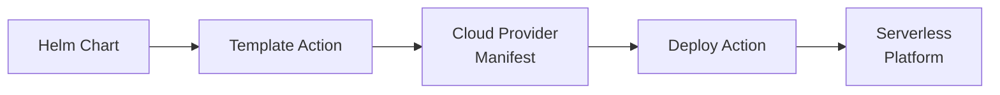

# What is Helmless?

!!! warning "Page under construction"

    🚧 This page is under construction. 🚧

Helmless is an open-source project that brings the power and simplicity of Helm to serverless deployments. It provides a familiar GitOps workflow for deploying containerized applications to serverless platforms like Google Cloud Run, without the complexity of Kubernetes or the verbosity of Terraform.

## Core Concepts

### 1. Helm-Based Deployments

Helmless uses Helm charts as the foundation for deployments, providing:

- **Familiar templating** - Use the same Helm syntax you already know
- **Value overrides** - Manage environment-specific configurations
- **Version control** - Track changes and rollback deployments
- **Package management** - Share and reuse deployment configurations

### 2. Direct Serverless Integration

Unlike traditional Helm charts that target Kubernetes, Helmless:

- Templates charts directly into cloud provider configurations
- Deploys using native cloud provider CLIs
- Bypasses the need for a Kubernetes cluster
- Maintains cloud-native best practices

### 3. GitOps Workflow

Helmless embraces GitOps principles by:

- Storing configuration as code
- Automating deployments through CI/CD
- Providing audit trails through Git history
- Enabling collaboration through pull requests

## How It Works

At its core, Helmless follows a simple workflow:

1. **Template**: Convert Helm charts to cloud provider configurations
2. **Validate**: Ensure configurations meet platform requirements
3. **Deploy**: Use cloud provider CLIs for direct deployment
4. **Monitor**: Track deployment status and health
## Key Components

Helmless consists of several specialized components:

### Charts

Cloud provider-specific Helm charts that define your application deployment:

### Actions

GitHub Actions that handle templating and deployment:

### Infrastructure Modules

Supporting infrastructure components:

## Benefits Over Alternatives

### vs. Kubernetes
- No cluster management overhead
- Faster deployments
- Lower operational costs
- Simplified scaling

### vs. Terraform
- More concise configurations
- Faster deployment cycles
- Familiar templating syntax
- Better developer experience

### vs. Platform-Specific Tools
- Cloud-agnostic approach
- Standardized workflow
- Reusable configurations
- Community-driven development

## Getting Started

Ready to try Helmless? Follow these steps:

1. **Choose your platform** - Start with Google Cloud Run
2. **Install the tools** - Set up Helm and cloud provider CLIs
3. **Configure your repository** - Add GitHub Actions workflows
4. **Deploy your first application** - Follow our quickstart guide

For detailed instructions, check out our [Google Cloud Run Guide](./docs/cloudrun/index.md).

## Next Steps

- Learn about the [Architecture](./architecture.md)
- Explore [Example Deployments](./docs/cloudrun/examples.md)
- Join our [Community](https://github.com/helmless/helmless/discussions)