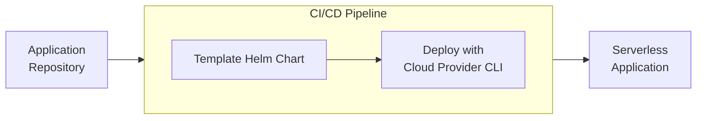

# Helmless.io

Kubernetes introduces unnecessary complexity for serverless-focused teams, and Terraform’s static workflows slow down deployment cycles.  
**Helmless** eliminates these roadblocks by combining Helm Charts with modern CI/CD pipelines, delivering a lightweight, cloud-agnostic solution for fast and efficient serverless deployments.

## Why Choose Helmless?

- Fast Deployments: Deploy serverless applications in minutes.
- Reduced Complexity: Avoid the overhead of Kubernetes and Terraform while maintaining a seamless, Kubernetes-like developer experience.
- Cloud Agnostic: Designed to be adoptable across major cloud providers.
- GitOps-First: Fully integrates with CI/CD pipelines for dynamic, automated deployments.
- Open Source: Join the community and contribute to a solution built to evolve with your needs.

Getting Started

Helmless makes serverless deployments effortless. Start your journey with one of these guides:

- [Deploy Your First Google Cloud Run Service using Helmless](./cloudrun/getting-started.md)
